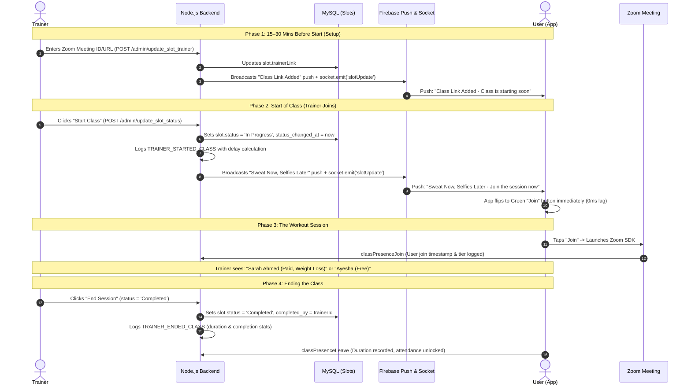
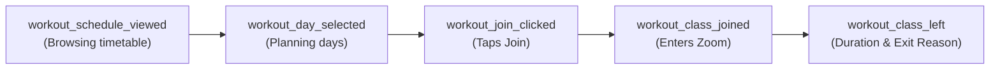

# Fither Workout Module — Complete End-to-End Guide

> **Scope:** Full lifecycle of a workout class, trainer actions, differences between paid vs. free users, push notifications, real-time sync, and operational analytics.

---

## 1. How a Class Starts & What the Trainer Does

A workout class transitions through four distinct operational phases driven by the trainer from their dashboard/portal:



### Trainer Step-by-Step Actions:
1. **Adding Link:** Trainer pastes their meeting link (e.g. Zoom meeting number `847...`). Backend pushes `"Class Link Added"` to enrolled clients.
2. **Starting Class:** Trainer taps **"Start Class"**. Backend flips `slot.status` from `'Upcoming Class'` to `'In Progress'`.
   - Backend records the exact timestamp (`status_changed_at`) and compares it against the scheduled time (e.g., `scheduledStart = 10:00 AM`, `actualStart = 10:03 AM` $\rightarrow$ `delay = +3m`).
3. **Leading Class:** Trainer views participant names in Zoom formatted with tier and goal (e.g., `Ayesha Khan (Paid, Weight Loss)`).
4. **Ending Class:** Trainer taps **"End Class"** (sets status to `'Completed'`). If a trainer forgets, a backend cron auto-ends the class once end time + grace period has passed, recording `completed_by = NULL` as an operational audit flag.

---

## 2. Paid User vs. Free Trial User: What is the Difference?

| Feature / Behavior | Paid Subscription Member | 3-Day Free Trial User |
| :--- | :--- | :--- |
| **Class Access** | Unlimited access to all live workout classes on their plan schedule every day. | Strictly **1 class per day** for the 3 trial days (booked via Day 1, Day 2, Day 3 tabs). |
| **Late Join Cutoff Gate** | Can join at any point while class is "In Progress" (even if 20 mins late). | **Cutoff enforced (`joinWindowMinutes`, default 15 min):** Barred from joining if class has progressed past 15 mins to protect trial experience. Shown a gentle modal with their next available class. |
| **First-Class Welcome** | Directly launches Zoom. | Shows motivational sheet: *"Ready for your first class? Here's what to expect"*. |
| **Freeze / Pause State** | Can pause/freeze membership from profile. While frozen, Join button shows disabled with toast: *"Your plan is paused"*. | Cannot freeze trial. |
| **Zoom Display Name** | Shows: `Name (Paid, Main Goal)`<br/>e.g. `Sarah Ahmed (Paid, Weight Loss)` | Shows: `Name (Free, Main Goal)`<br/>e.g. `Hira Noor (Free, PCOS)` |
| **Attendance Unlock** | Attendance marked immediately on join. | Requires at least **10 minutes of active presence** (`durationSeconds >= 600`) before trial day attendance is unlocked. |
| **Post-Class Action** | Rate & review bottom sheet opens 5 mins into class. | Unlocks next trial day booking or trial conversion / discount purchase card. |

---

## 3. What Notifications Go to the User?

All push notifications are delivered via **Firebase Cloud Messaging (FCM)** and synchronized in-app via **Socket.IO**:

```
Before Class (15 min) ──> Trainer Starts (0 min) ──> In-Class Attendance ──> After Class Missed
   [Upcoming Class]          [Sweat Now...]             [Presence Log]        [Missed Session]
```

### Notification Schedule & Triggers:

#### 1. 15 Minutes Before Class (`classPrep`)
* **Trigger:** Automated backend cron runs every 5 minutes checking upcoming bookings.
* **Title:** `Upcoming Class`
* **Body:** `"Your [Class Name] class starts in 15 minutes! Get your water bottle ready 🧘‍♀️"`
* **Target:** Enrolled paid members and trial users who booked this slot.

#### 2. Class Link Added (`classLinkAdded`)
* **Trigger:** Trainer submits or updates Zoom meeting ID before class.
* **Title:** `Class Link Added`
* **Body:** `"Class is starting soon. Trainer has added the session link."`

#### 3. Trainer Starts Class (`classStart`)
* **Trigger:** Trainer flips status to `"In Progress"`.
* **Title:** `Sweat Now, Selfies Later`
* **Body:** `"Join the session now. Trainer has started the workout!"`
* **Real-time Socket:** In-app users on the schedule tab see the button instantly pulse green to **"Join"** without pulling down to refresh.

#### 4. Class Cancelled (`trainerCancelled`)
* **Trigger:** Admin or trainer cancels the slot in emergency.
* **Title:** `Class Cancelled`
* **Body:** `"Sorry, your upcoming class has been cancelled. Please select another slot."`

#### 5. Missed Class Recovery (`missedRecovery`)
* **Trigger:** Hourly cron (`17 * * * *`) checks users whose final scheduled class ended 30+ minutes ago with no attendance recorded.
* **Title:** `Missed Session`
* **Body:** `"We missed you in class today! Remember, consistency is key to your progress."`

---

## 4. End-to-End Analytics Matrix

Both **Client-side events (Mixpanel)** and **Backend operational logs** work together to track every step of the funnel:



### Complete Event Specification:

#### 1. `workout_schedule_viewed` (Mixpanel)
* **When:** User navigates to the Workout tab.
* **Properties:** `plan_id`, `user_tier` (`paid` vs `free_trial`), `day_of_week`.
* **Insight:** Measures Daily Active Users (DAU) engaging with workout schedules.

#### 2. `workout_day_selected` (Mixpanel)
* **When:** User taps a weekday pill (Mon–Sun) on the timeline.
* **Properties:** `selected_date`, `day_name`, `is_today` (`true`/`false`).
* **Insight:** Measures whether users only check today or actively plan their upcoming week.

#### 3. `workout_join_clicked` (Mixpanel)
* **When:** User clicks the green "Join" / "Join Now" button.
* **Properties:** `slot_id`, `class_name`, `trainer_name`, `user_tier`, `link_type` (`zoom_native` vs `https_url`).
* **Insight:** Measures join intent before Zoom opens.

#### 4. `workout_class_joined` (Mixpanel + Backend DB)
* **When:** User successfully enters the Zoom meeting.
* **Properties:**
  * `slot_id`, `class_name`, `trainer_name`, `user_tier`
  * `scheduled_start_time` (e.g. `"10:00 AM"`)
  * `actual_join_time` (ISO timestamp)
  * `delay_from_schedule_minutes` (e.g. `+4` min late or `0` on time)
  * `source` (`'zoom_native'`)
* **Backend:** Creates a record in `ClassPresences` table (`userId`, `slotId`, `joinedAt`, `lastSeenAt`).

#### 5. `workout_class_left` (Mixpanel + Backend DB)
* **When:** User leaves Zoom, drops off, or meeting ends.
* **Properties:**
  * `slot_id`, `class_name`, `trainer_name`, `user_tier`
  * `duration_minutes` (e.g. `42`) & `duration_seconds` (e.g. `2520`)
  * `exit_reason`: `'completed'` (stayed till end), `'dropped_early'`, or `'failed'`
  * `left_at` (ISO timestamp)
* **Backend:** Updates `ClassPresences` with `leftAt` and `durationSeconds`. Unlocks trial day if $\ge 10$ minutes attended.

#### 6. Trainer Punctuality & Audit (`partner_backend` logs)
* **`TRAINER_STARTED_CLASS`:** Logged when status flips to `"In Progress"`. Records `scheduledStart` vs `actualStart` and trainer ID.
* **`TRAINER_ENDED_CLASS`:** Logged when status flips to `"Completed"`. Records `totalDurationMinutes` and whether ended by `trainer` or `auto_end_cron`.

---

## 5. Summary Cheat Sheet

```
+---------------------------------------------------------------------------------------+
|                               FITHER WORKOUT CHEAT SHEET                              |
+---------------------------------------------------------------------------------------+
|  TRAINER ACTION   |  Flip status to "In Progress" in portal                           |
|  NOTIFICATION     |  "Sweat Now, Selfies Later · Join the session now"                |
|  APP UPDATE       |  Socket.IO immediately turns timeline button into Green "Join"     |
|  ZOOM NAME        |  "Sarah Ahmed (Paid, Weight Loss)" or "Ayesha (Free, PCOS)"       |
|  PAID USER GATE   |  Unlimited access; blocked only if plan is explicitly paused      |
|  FREE USER GATE   |  1 class/day; barred if joining >15 min late; 10 min for credit   |
|  TELEMETRY        |  Punctuality delay on join; exact minutes & seconds on leave      |
+---------------------------------------------------------------------------------------+
```
